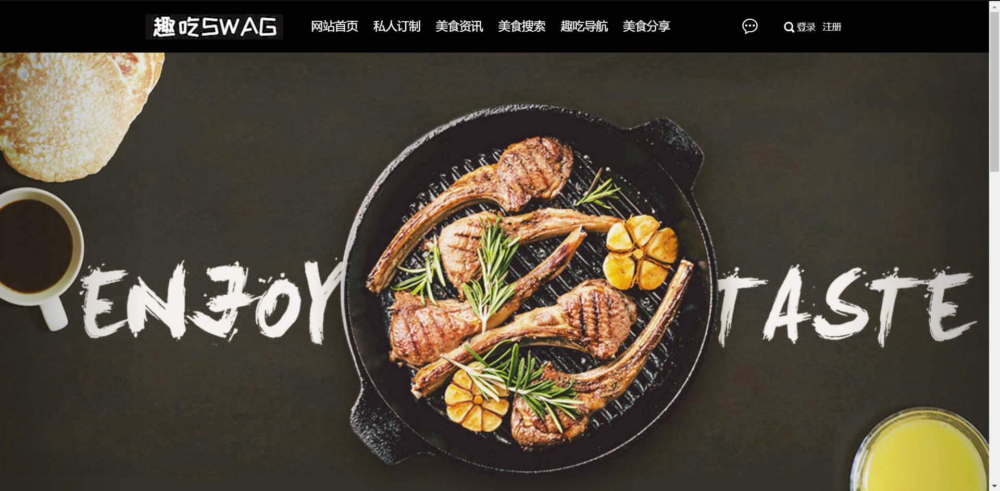

# 2016级项目实训成果展示 

## 趣吃 - 大数据

### 项目简介

随着生活节奏的加快，以及我国政府提出扩大内需的大背景下，外卖送餐逐渐成为越累越多用户的消费习惯。
艾瑞咨询表示，2017年我国餐饮外卖市场占整体餐饮消费的百分之十，外卖市场规模也将超过3000亿。
我们希望通过我们的努力，让广大的创业者与商家能建立有效联系，创立了一个良好的对接环境。
除此之外，广大的吃货朋友们还可以通过中华美食网学习各种菜谱做法、烹饪技巧、健康饮食知识，还可以在平台找到各地特色小吃、分享自己的做菜成果。

### 项目地址
- Github：[https://github.com/TastyTeam/Tasty](https://github.com/TastyTeam/Tasty)

### 项目成员

- 袁培凯（项目经理、UI设计师、开发工程师、测试工程师）
  - Email：[1483078467@qq.com](mailto:1483078467@qq.com) 
  - Github：[https://github.com/yuanpeikai](https://github.com/yuanpeikai)

- 祁虹蕾（UI设计师，开发工程师，测试工程师）
  - Email：[1002323776@qq.com](mailto：1002323776@qq.com)
  - Github：[https://github.com/qihonglei](https://github.com/qihonglei)

- 王梦真（技术总监、UI设计师、开发工程师、测试工程师）
  - Email：[15530169902@163.com](mailto：15530169902@163.com)
  - GitHub：[https://github.com/wangmengzhen](https://github.com/wangmengzhen)

- 曹泽辰（技术总监、UI设计师、开发工程师、测试工程师）
  - Email：[m15226507930_1@163.com](mailto:m15226507930_1@163.com)
  - Github：[https://github.com/caozechenc](https://github.com/caozechenc)
  
- 成琼（UI设计师、开发工程师、测试工程师）
  - Email：[1538549768@qq.com](mailto:1538549768@qq.com)
  - Github：[https://github.com/class2chengqiong](https://github.com/class2chengqiong)

  
  

### 项目截图

